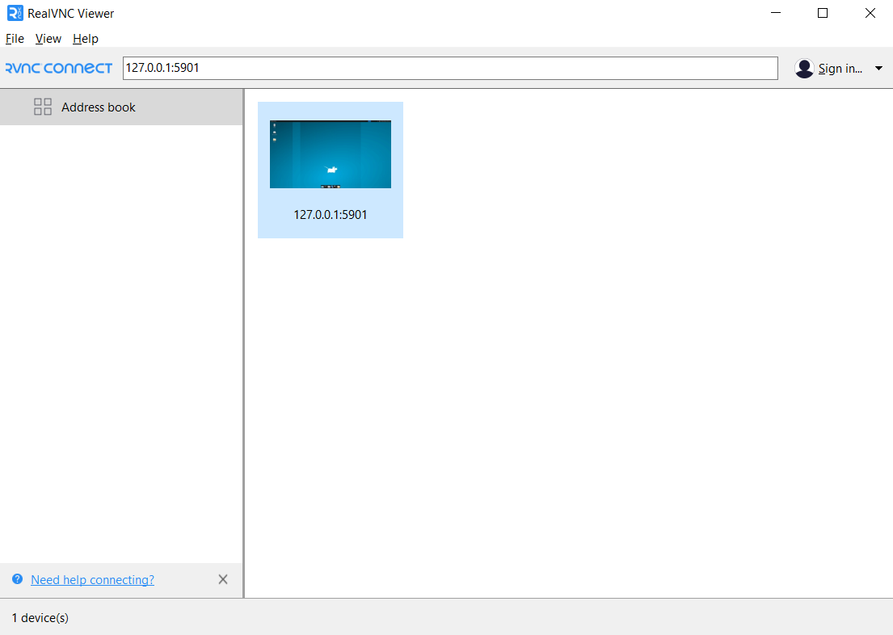
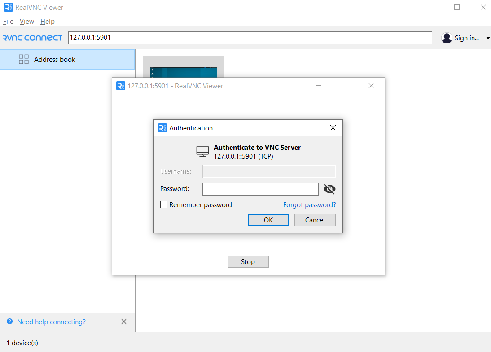
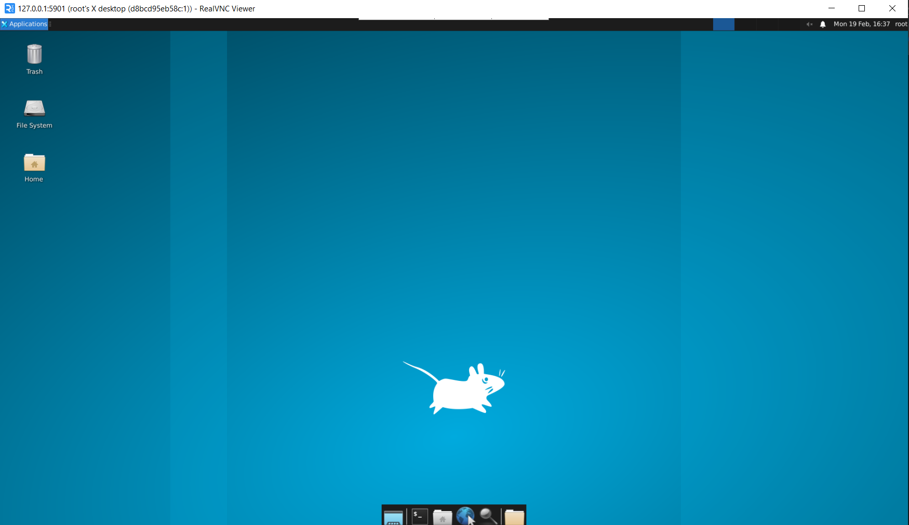
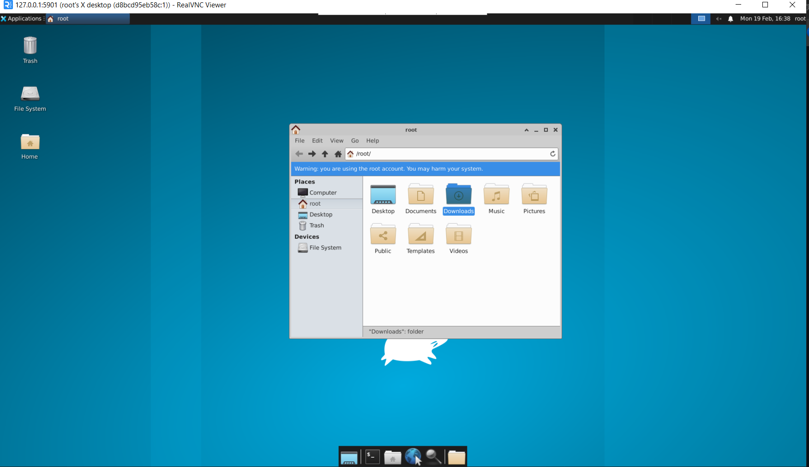

<font size = "5">**Hoàng Văn Quyền - 21020787**</font>  

## `Docker` và `Docker Compose`
- `Docker` là một nền tảng mở cho phép chúng ta xây dựng, triển khai và quản lý các ứng dụng trong các `container`. Một `container` `Docker` là một môi trường chứa mọi thứ cần thiết để chạy một ứng dụng, bao gồm mã nguồn, thư viện, biến môi trường và các dependency. `Docker` cho phép chúng ta đóng gói ứng dụng cùng với môi trường chạy của nó vào một `container` duy nhất, đảm bảo rằng ứng dụng sẽ hoạt động một cách nhất quán và có thể di chuyển giữa các môi trường khác nhau mà không cần thay đổi.
- `Docker file`: là file có chức năng mô tả cho docker cách xây dựng lên một `image`, `Docker file` có tên duy nhất là `Dockerfile`, các tên khác đều không hợp lệ.
- `Docker image`: là một đơn vị đóng gói chứa mọi thứ cần thiết để một ứng dụng chạy.
- `Docker container`: Một `image `có thể được sử dụng để tạo một hoặc nhiều `container`, mỗi `container` như một hệ điều hành thực sự. `Container` và `VM` có sự cách ly và phân bổ tài nguyên tương tự nhưng có chức năng khác nhau vì `container` ảo hóa hệ điều hành thay vì phần cứng. Các `container` có tính portable và hiệu quả hơn.
- `Docker Compose` là một công cụ sử dụng để định nghĩa và quản lý các ứng dụng đa `container` trong `Docker`. Thay vì phải sử dụng nhiều lệnh Docker để tạo và quản lý các container riêng lẻ, Docker Compose cho phép chúng ta định nghĩa tất cả các `container` cần thiết trong một file đơn giản và sau đó sử dụng một lệnh duy nhất để khởi chạy, dừng và quản lý toàn bộ ứng dụng. File cấu hình của `Docker Compose` là `docker-compose.yml`, trong đó chúng ta có thể định nghĩa các `container`, cài đặt mạng, thiết lập volumes và nhiều thiết lập khác liên quan đến việc triển khai ứng dụng.
## `Unix` vs `Linux` vs `BSD` vs `*nix`, `MacOs` thuộc loại nào?
- `Unix` là một hệ điều hành nhân (kernel) và hệ điều hành có nguồn gốc từ năm 1969, được phát triển bởi AT&T Bell Labs.
- `Linux` là một hệ điều hành mã nguồn mở dựa trên Unix. Nó bao gồm kernel Linux, một số lượng lớn các thành phần phần mềm mã nguồn mở và một số bản phân phối khác nhau như Ubuntu, Debian, Fedora, CentOS, và nhiều hơn nữa. Linux không phải là Unix, nhưng nó được thiết kế để tương thích với hệ thống Unix và có các đặc điểm và chức năng tương tự.
- `BSD` (Berkeley Software Distribution) là một họ các hệ điều hành dựa trên Unix, chia sẻ một số lượng lớn mã nguồn với Unix gốc.
- `*nix` là một thuật ngữ toàn diện được sử dụng để chỉ đến các hệ điều hành có liên quan đến Unix, bao gồm cả Unix, Linux, BSD và các hệ thống tương tự.

`MacOS` là một phần của họ `*nix`, là một hệ điều hành dựa trên nền tảng của `BSD`.

## `Alpine` vs `Ubuntu`
`Alpine` và `Ubuntu` đều là những bản phân phối linux phổ biến:
- `Alpine` được ưa chuộng trong các môi trường container nhờ kích thước nhỏ và hiệu suất cao, sử dụng `apk` để quản lý gói.
- `Ubuntu` là lựa chọn đa dụng cho máy tính cá nhân, máy chủ và môi trường phát triển, với hỗ trợ đa dạng và sử dụng `apt` hoặc `apt-get` để quản lý gói.
## `VNC`
`VNC` - Virtual Network Computing là một công nghệ cho phép điều khiển và sử dụng máy tính từ một thiết bị khác thông qua mạng Internet hoặc mạng nội bộ (giống `Ultraviewr`). `VNC` bao gồm 2 phần chính: `VNC Server` cài đặt trên máy tính chúng ta muốn điều khiển, `VNC Viewer` cài đặt trên máy tính thực hiện điều khiển.

## Sử dụng Docker tạo 1 image, cài đặt vnc-server và Desktop Environment `xfce`
Demo trên thiết bị sử dụng phiên bản windows 10  
Yêu cầu: Đã cài đặt Docker và Docker đã được khởi chạy.  
### Bước 1: Chạy container, cài đặt các package cần thiết và `vnc-server`
- Pull image ubuntu:
```
docker pull ubuntu:latest
```
- Khởi chạy container từ image ubuntu, với biến môi trường USER nhận giá trị root:
```
docker run -it -p 5901:5901 -e USER=root ubuntu:latest
```

- Cài đặt các package cần thiết
```
apt update  
apt install xfce4 xfce4-goodies  
apt install nano
apt install tightvncserver
```
- Khởi chạy `vnc-server` và đặt password, ở demo này `password`=abcdefgh
```
vncserver
```

```
Output
You will require a password to access your desktops.

Password:
Verify:
```
```
Output
Would you like to enter a view-only password (y/n)? n
```
### Bước 2: Cài đặt `vnc-server`
```
vncserver -kill :1 # Dừng instance vnc-server đang chạy
```
- Terminal sẽ hiển thị:
```
Output
Killing Xtightvnc process ID 17648
```
```
mv ~/.vnc/xstartup ~/.vnc/xstartup.bak # Backup file xstartup trước khi chỉnh sửa
```
- Tạo một file `xstartup` mới và mở file đó bằng nano:
```
nano ~/.vnc/xstartup
```
- Thêm những dòng này vào file `xstartup`
```
#!/bin/bash
xrdb $HOME/.Xresources
startxfce4 &
```
- Lưu và đóng file bằng cách nhấn `CTRL + X`, `Y` và `Enter`
- Cấp quyền thực thi cho file `xstartup` vừa tạo:
```
chmod +x ~/.vnc/xstartup
```
- Khởi động lại `vnc-server`:
```
vncserver -geometry 1920x1080 :1
```
### Bước 3:Sử dụng `vnc-client` trên máy thật để kết nối với `vnc-server` trên máy ảo
- Tải và cài đặt [`vnc-viewer`](https://www.realvnc.com/en/connect/download/viewer/)
- Nhập `127.0.0.1:5901` vào ô địa chỉ của `vnc-viewer` để tiến hành kết nối  

  

- Tiến hành nhập `password`  

  

- Sau khi nhập `passsword`, `vnc-viewer` đã hiển thị DE `xfce`    





